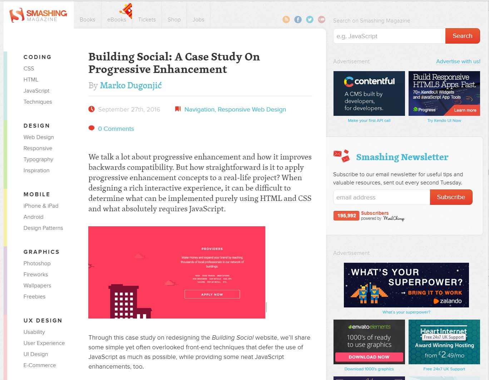
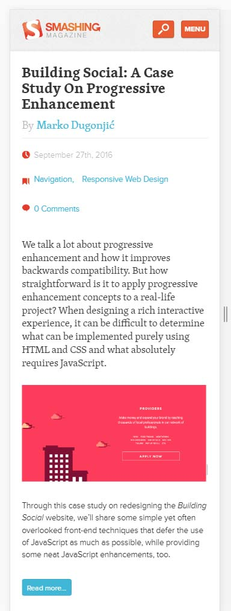
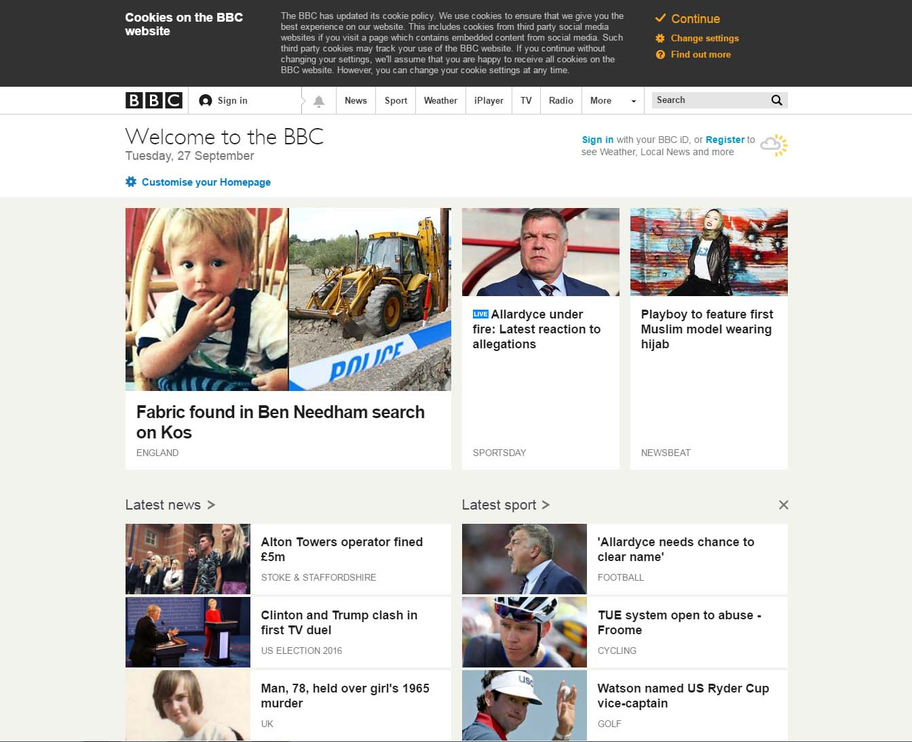
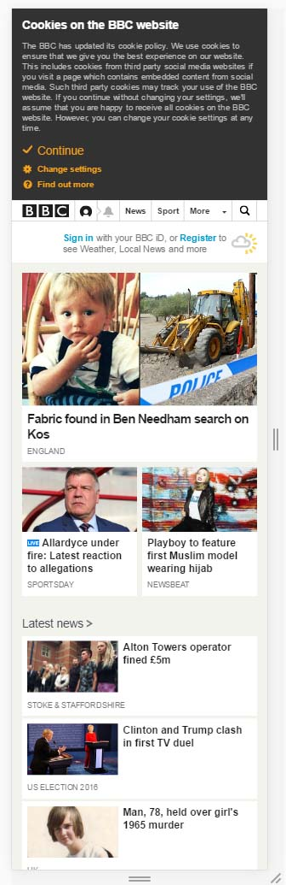
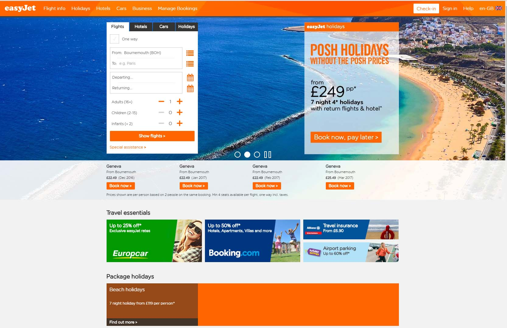
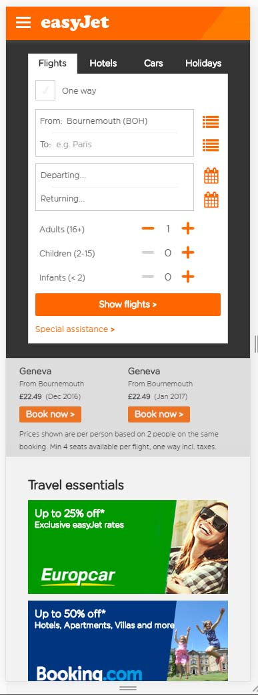

#Website Design SWD500

## Session 2: Responsive Web Design Experimentation 

This weeks practicle is about responsive design and explorinjg different types of responsive websites and how they work. Some of the websites that i am going to be looking at are: Smashing Magazine, the BBC and EasyJet. 

## Smashing Magazine
[Link to Smashing Magazine](https://www.smashingmagazine.com/)
>> Images From Webpages By Using Developer Tools  
## Desktop Layout  
 Figure 1   
  
## Web Layout  
 Figure 2   
  

## BBC Homepage 
[link to The BBC Homepage](http://www.bbc.co.uk/)

## Desktop Layout 
 Figure 1  
  

## Web Layout 
 Figure 2  
   

## EasyJet 
[Link To EasyJet](http://www.easyjet.com/en)

## Desktop Layout 
 Figure 1  
  

## Web Layout 
 Figure 2  
    

## Non Responsive Webpages 
[Link to the worlds worst websites](http://www.webpagesthatsuck.com/)  

## Learning how to use markdown ie this is a heading 
## Responsive-Design-Website-Design-Unit-

first look in to responsive design  
new lines equal 2 spaces 

[link to google](http://www.google.co.uk)

>>  this is a note 

-point 1 
-point 2 

 small text  

'''html
<h1> html code block </h1>
'''

![kowla image] (JKoala.jpg)
 figure 1   
